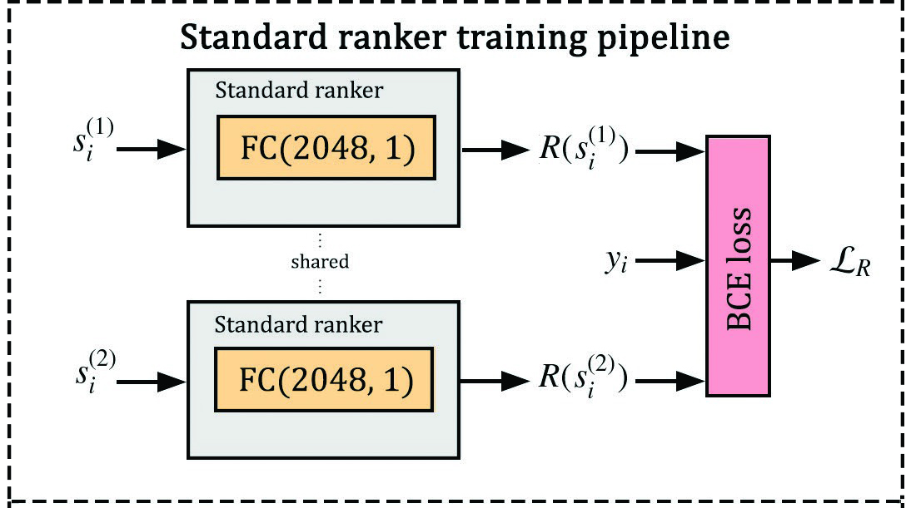
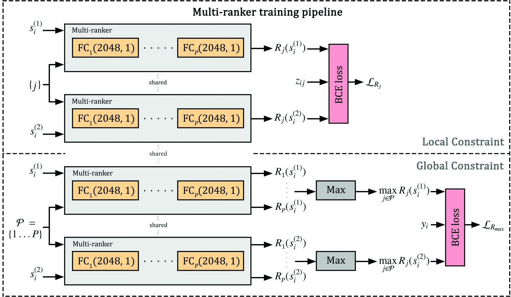

# [Multiple Pairwise Ranking Networks for Personalized Video Summarization](https://www.yongliangyang.net/docs/multiRanker_iccv21.pdf)

This repository provides PyTorch implementations for Multi-ranker paper published in ICCV 2021.

This code is based on [DR-DSN](https://github.com/KaiyangZhou/pytorch-vsumm-reinforce) and [VASNet](https://github.com/ok1zjf/VASNet) implementations.

## Pairwise Ranking Model for Global Summarization (Standard ranker)

Standard ranker learns a ranking function that associates high ranking scores to important video segments so that a summary can be built by selecting the top-ranked segments.

<p align="center">

</p>

## Multiple Pairwise Ranking Model for Personalized Summarization (Multi-ranker)

Given the number of preferences , Multi-ranker learns a set of  sub-rankers that are jointly trained so the local summaries conform with the preferences and the global summary max-aggregates the sub-rankers' scores. 

<p align="center">

</p>

## Datasets

### [TVSum](https://github.com/yalesong/tvsum)

TVSum dataset is a collection of 50 YouTube videos grouped into 10 categories. Each video is split into a set of 2 second-long shots. 20 users are asked to rate how important each shot is, compared to other shots from the same video in order to build 20 reference summaries. The GT summary for each video is defined as the mean of the corresponding 20 reference summaries.

### [SumMe](https://gyglim.github.io/me/vsum/index.html)

SumMe dataset is constituted of 25 videos containing a variety of events. For each video, 15 to 18 reference interval-based keyshot summaries were associated. These summaries are converted to frame-level reference summaries by marking the frames contained in the keyshots with score 1 and frames not contained in the keyshots by
score 0. Afterwards, the GT summary associated with each video is defined as the mean of 15 to 18 reference summaries.

### [FineGym](https://sdolivia.github.io/FineGym/)

FineGym is a fine-grained action recognition dataset that provides action level temporal annotations for 156 YouTube gymnasium videos. Since the videos are of long duration, we only used 50 sampled videos for experiments purpose and listed their ID in the Supplemental Material. In this case, we do not have reference summaries instead, we define one reference summary and the GT summary for each video by marking the frames contained in the action keyshots with score 1 and frames not contained in the keyshots by score 0.

## Datasets Preprocessing

We opt for the following dataset preprocessing to obtain the videos' segment features:

- [3D ResNet](https://github.com/kenshohara/video-classification-3d-cnn-pytorch) pretrained on Kinetics with features of 2048 dimensions where each feature represents a segment of 16 frames (mainly used for FineGym dataset).
- The [baseline features](https://kingston.box.com/shared/static/zefb0i17mx3uvspgx70hovt9rr2qnv7y.zip) provided by [VASNet](https://github.com/ok1zjf/VASNet) with features of 1024 dimensions where each feature represents a segment of 15 frames (mainly used for SumMe and TVsum datasets).

This code relies on the [baseline features](https://kingston.box.com/shared/static/zefb0i17mx3uvspgx70hovt9rr2qnv7y.zip) with the corresponding files `eccv16_dataset_tvsum_google_pool5.h5` and `eccv16_dataset_summe_google_pool5.h5` for TVSum and SumMe datasets respectively. However, these files are designed for the classical summarization pipeline (importance score estimation + KTS segmentation + segments selection) while the summarization pipeline in this work consists only of importance score estimation. We suggest the updated baseline with altered files to `iccv21_dataset_tvsum_google_pool5.h5` and `iccv21_dataset_summe_google_pool5.h5` by deleting irrelevant keys and modifying the key `user_summary` to correspond to the original users/annotators reference summaries in [TVSum](https://github.com/yalesong/tvsum) and [SumMe](https://gyglim.github.io/me/vsum/index.html).

## Prerequisites

- Python 3.6.9
- Pytorch 1.3.1
- NVIDIA GPU + CUDA 9.2
- Torchvision 0.4.2

## Getting Started

### Installation

- Install PyTorch and Torchvision from [http://pytorch.org](http://pytorch.org) or through the following pip/conda commands:
```shell
pip install torch==1.3.1+cu92 torchvision==0.4.2+cu92 -f https://download.pytorch.org/whl/torch_stable.html
```
```shell
conda install pytorch==1.3.1 torchvision==0.4.2 cudatoolkit=9.2 -c pytorch
```
- Clone this repository.
```shell
git clone https://github.com/saquil/Multi-ranker
cd Multi-ranker
```

### Standard ranker training

- Run `generate_pairset.py` to generate segment-level pairwise comparisons per each video using the [updated baseline](https://google.com) files of each dataset `iccv21_dataset_tvsum_google_pool5.h5` and `iccv21_dataset_summe_google_pool5.h5`.

- Run `dataset/create_split.py` to generate a json file that contains the dataset splits and the training, validation, and test sets according to the experimental protocol.

- Run `launch_exp.py` to launch the training of Standard ranker per each split for a selected validation/test option. Or simply set your parameters and run `main.py` like the following:
```shell
python3 main.py --epoch=1 --batch_size=128 --dataset=tvsum --mode=training --model_name=ranker_b128_p2_s0_v4 --pairset=./pairset/tvsum/pairs_2k.npy --split=0 --validation=4
```
```shell
python3 main.py --epoch=1 --batch_size=128 --dataset=summe --mode=training --model_name=ranker_b128_p2_s0_v4 --pairset=./pairset/summe/pairs_2k.npy --split=0 --validation=4
```
### Standard ranker evaluation

- Run `gather_exp.py` to aggregate the evaluations of the trained Standard rankers across the dataset splits for a selected validation/test option.

```python
python3 gather_exp.py --save_dir=models/tvsum --metric=kendall
python3 gather_exp.py --save_dir=models/tvsum --metric=spearman
```
```
Standard ranker kendall tau validation-test: [0.17585701/0.02330799]
Human kendall tau validation-test: [0.17551309/0.02265591]
Standard ranker spearman rho validation-test: [0.23019827/0.03071953]
Human spearman rho validation-test: [0.20185220/0.02602781]
```

### Multi-ranker training


### Multi-ranker evaluation


### Plots & Results


## Citation


## Poster and Supplementary Material
